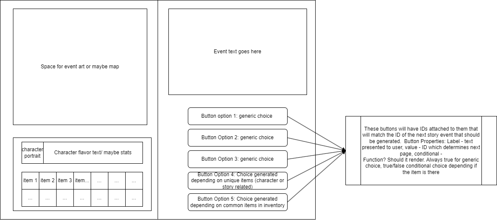

# Jason Church

## Escape from (TENTATIVE TITLE)

### Project's Goal: 
The project will be a Choose-Your-Own Adventure game app that takes a user through a branching story of events related to the user's choices. 

### MVP :

* Branching story that least goes 15 events in to showcase as a demo
* 1 initial character generated with an item inventory
* Story book-esque UI that displays story event and up to 5 event choices as buttons. 3 generic choices that always show up and 2 other, optional choices that show up depending on the character and items in inventory 

### Languages/Frameworks:
* Languages: Mainly want to do this in typescript
* Front-End: React
* Back-End: Undetermined at the moment. Need to research Firebase. Character, Items, Story events will all be data that needs to be stored somewhere.

### Stretch Goals: 
* Many more events, maybe even create a full story. If I can get the initial logic in place, this should be easy to implement. Just need to judge time on how much events I can make. 
* Multiple characters for more replayability
* Create art assets
* Animation for initial rendering of the app and maybe even page flipping
* Have a map at the bottom of UI for sense of geography 
* Additional system that keeps track of key events that happened and generates unique options depending on the event
* Character stats (very low priority)

